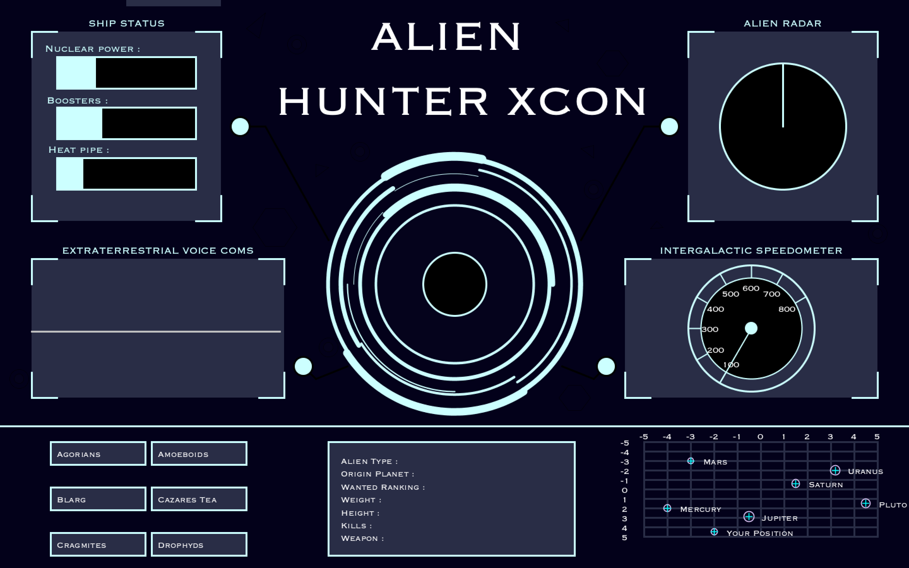

# SciFi UI Project

Name: Cian Morrin

Student Number: C17718445


# Description of the assignment

For this assignment we were given the task of creating a UI for a sci-fi movie device. After contemplating several ideas, the structure of a centre rotation element, surrounded by several informative panels, was the one which I believed I could express my coding abilities and also be proud of the aesthetic look of the UI. 

My user-interface is for an 'Alien Hunter' ship. The interface is powered up by the button located in the centre of the screen. From there, the interface is live. Bar charts representing different ship components fluctuate constantly, the radar circulates and locates different aliens, voice communication device uses the microphone to display noise input, and also the speedometer which is controlled by the user.

Adding to the ships components is a dashboard, used to display information about the aliens and their location. The interactive planet map can be utilised to reveal the distance between the planets and the users location.


# Instructions

1 . When the program is run, the UI is "powered down". Upon *clicking the centre circle*, the interface awakens and is live.

2 . The speedometer is controlled by the space bar. *Holding the space bar* will increase the speed until it hits the limit.
The speed will then decrease automatically when the space bar is released. Much like a car accelerator.

3 . The 6 buttons on the bottom left corner represent different alien species. *Clicking an indivudal button* revelas the information about the alien in the centre window. 

4 . The planet map in the bottom right corner works by *clicking an individual planet*, dragging the mouse to another planet and releasing it. From there the distance between the two planets (or position) is displayed to the screen.

5 . *Noise input is registered* in the voice communication device. 


# How it works

The UI class declares and instantiates the classes by allocating memory for the objects. From there the methods such as render and update are called. Eg. 

```Java
public void setup()
    {
        ch = new CentreHub(this, width, height, PI, QUARTER_PI, HALF_PI, TWO_PI, 0, 0); 
        li = new Lines(this, width / 2, 200);
        b = new Button(this, 50, 50, 100, 50, "I am a button");
        mb = new MovingRect(this, 200, 0, 150, 10, "I am bigger moving button");
        r = new Radar(this, 1, width - 200, 200, 100);
        bc = new BarChart(this, 200, 200);
        vc = new VoiceComs(this, 200, 560);
        sp = new Speedometer(this, width - 300, 560);
        
        sh = new Shapes(this, width / 2, height / 2);
        tr = new Triangle(this, width / 2, height / 2);
        hex = new Hexagon(this, width / 2, height / 2);

        loadData();
        printStars();
    
    }
    
public void draw()
    {
      li.render();
      li.update();
      strokeWeight(3f);

      fill(startCircle);
      stroke(204, 255, 255);
      circle(width/2, height/2, 100);
     
      fill(255);
      stroke(255);
      
      
      mb.render();
      mb.update();

      r.render();
      r.update();
      
    }
```

Some of the features I included in my program : 

- #### Variables, loops

Here I have used a for each loop to itertae through the array list, initialising the float variables x and y with values, using the map function in order to calculate suitable co-ordinates for the map. These variables are use to draw the planets on the map. This is called in draw then to display the planets on the map. 

```Java
public void drawPlanets()
    {
        textAlign(LEFT, CENTER);
        for (Planet s : planets) 
        {
          float x = map(s.getxG(), -5, 5, (width / 2) + 300, width - 50);
          float y = map(s.getyG(), -5, 5, 700, height - 50);

            strokeWeight(1.5f);
            stroke(229, 204, 255);
            noFill();
            ellipse(x, y, s.getAbsMag(), s.getAbsMag());

            stroke(0, 255, 255);
            line(x, y - 5, x, y + 5);
            line(x - 5, y, x + 5, y);
            fill(255);
            text(s.getDisplayName(), x + 20, y);
         }
    }
 
    }
```

- #### Array lists & methods

I created an array list which reads from a CSV file and adds the contents to the array list by iterating over the rows.

```Java

 ArrayList<Alien> aliens = new ArrayList<Alien>();
 
 
 void loadAliens()
    {
        Table table = loadTable("alien.csv", "header");
        for(TableRow tr:table.rows())
        {
           Alien a = new Alien(tr);
           aliens.add(a);
       }        
    }
    }
```

- #### Inheritance

The class MovingRect inherits from the class provided to us in the original repository, thus the object acquires all the properties and behaviors of the parent object. But I overrided the methods so the button would move and bounce of the sides of the screen.

```Java

 public class MovingRect extends Button
{
    private float dx = 10;

    public MovingRect(UI ui, float x, float y, float width, float height, String text)
    {
      super(ui, x, y, width, height, text);
    }

    public void render()
    {
        ui.fill(41, 45, 70);
        ui.noStroke();
        ui.rect(x, y, width, height);
        ui.textAlign(PApplet.CENTER, PApplet.CENTER);
    }

    public void update()
    {
        x += dx;
        if ((x > ui.width - width) || (x < 0))
        {
            dx *= -1;
        }
    }
```

- #### Polymorphism

Here I override the methods of the class Shape in the sub classes Triangle and Hexagon.

```Java
 Shapes sh, tr, hex;
 
  sh = new Shapes(this, width / 2, height / 2);
  tr = new Triangle(this, width / 2, height / 2);
  hex = new Hexagon(this, width / 2, height / 2);
 
 
 public class Shapes
{
    UI ui;
  
    public float x ;
    public float y ;
    private int i = 1, j = 1;
  

    public Shapes(UI ui, float x, float y)
    {
        this.ui = ui;
        this.x = x;
        this.y = y;
    }

    public void create()
    {   
        if (i == 0 || i == 255) { j = -j; }
        i += j;
        ui.fill(255,255,224, i);
        ui.ellipse(x, y, 250, 250);
     }
     
}


public class Triangle extends Shapes
{

    public Triangle(UI ui, float x, float y)
    {
       super(ui, x, y);
    }

    public void create()
    {   
        //System.out.println("x is : " + x + "\n");

        ui.noFill();
        ui.strokeWeight(0.5f);
        ui.triangle(x - 220, y - 170, x - 220, y - 190, x - 200, y - 185);
      
    }
}

public class Hexagon extends Shapes
{
    public Hexagon(UI ui, float x, float y)
    {
       super(ui, x, y);
    }

    public void create()
    {   
        ui.strokeWeight(0.5f);
        ui.line(x - 300, y - 120, x - 270 , y - 120);
        ui.line(x - 300, y - 120, x - 320 , y - 90);
        ui.line(x - 270 , y - 120, x - 250 , y - 90);
       
       //two bottom half verticles left and right
        ui.line(x - 320 , y - 90, x - 300, y - 60);
        ui.line(x - 250 , y - 90, x - 270, y - 60);

        //bottom line
        ui.line(x - 300, y - 60, x - 270 , y - 60);
	}
}
```

- #### The unit circle and trigonometry

Using cos, sin to draw a speedometer and ensure perfect angles for the circle's speedd markers. Also used to manipulate the pointer in the speedometer.

```Java

for (int i = 0; i <240 ; i+=30) 
        {
            ui.stroke(204, 255, 255);
            xradiusLine=x+radius*(cos(radians(30 + i)));
            yradiusLine=y-radius*(sin(radians(30+ i)));
            ui.line(x, y, xradiusLine, yradiusLine);
        }
```
- #### pushMatrix, popMatrix, translate and rotate

Here is a simple example of my use pushMatrix, popMatrix, translate and rotate. Here I took a small circle and translated it to be in the centre of the speedometer to cover the base of the pointer.

```Java

        ui.pushMatrix(); 
        ui.translate(x,y); 
        ui.rotate(-PI/3);
        ui.fill(204, 255, 255);
        ui.ellipse(0,0,20,20);
        ui.popMatrix(); 
    }
```


# What I am most proud of in the assignment

I am very proud of the aesthetic look of the UI and the functionality behind it. Drawing from and expanding on lab work throughout the semester, I implemented the knowledge I have gained and created an interface I'm very proud of. 

I did my first commit on March 19th, and I am very happy with my steady progress over the successive weeks. Manipulating the  sketches and ideas we have visited in class gave me a far greater understanding into the workings of the code, along with this I challeneged myself to come up with some ideas of my own. The use of the unit circle and trigonometry interests me and I implemented this in the creation of the speedometer. The moving bar charts, and the speedometer's needle being manipulated by the space bar were two more aspects I was happy to implement as I intended. I was also very pleased with the rotating 'centre-hub' and how it comes to life when the centre button is selected. 

The concept of an Alien Hunter was one that developed over the course of the assignment as I initially had more of a visual reprenstation of the interface. I think the concept expanded into something very cool and I would like to expand upon in the future as my experience with processing grows, I think there is room for more complex code and as a result more usable applications in the interface.

# Images 

UI before being powered up : 



UI when  powered up :


# YouTube 

Link to video : 

[Alien Hunter Youtube Video](https://youtu.be/C-FxErOnQZ8)

