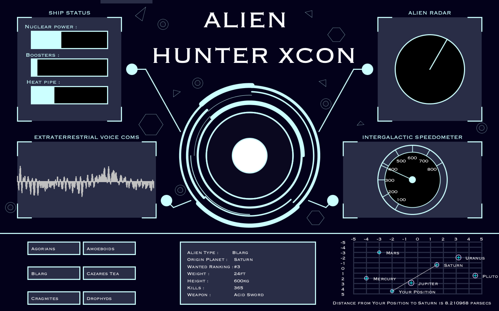

# SciFi UI Project

Name: Cian Morrin

Student Number: C17718445


# Description of the assignment

For this assignment we were given the task of creating a UI for a sci-fi movie device. After contemplating several ideas, the structure of a centre rotation element, surrounded by several informative panels, was the one which I believed I could express my coding abilities and also be proud of the aesthetic look of the UI. 

My user-interface is for an 'Alien Hunter' ship. The interface is powered up by the button located in the centre of the screen. From there, the interface is live. Bar charts representing different ship components fluctuate constantly, the radar circulates and locates different aliens, voice communication device uses the microphone to display noise input, and also the speedometer which is controlled by the user.

Adding to the ships components is a dashboard, used to display information about the aliens and their location. The interactive planet map can be utilised to reveal the distance between the planets and the users location.

# Instructions

1 . When the program is run, the UI is "powered down". Upon *clicking the centre circle*, the interface awakens and is live.

2 . The speedometer is controlled by the space bar. *Holding the space bar* will increase the speed until it hits the limit.
The speed will then decrease automatically when the space bar is released. Much like a car accelerator.

3 . The 6 buttons on the bottom left corner represent different alien species. *Clicking an indivudal button* revelas the information about the alien in the centre window. 

4 . The planet map in the bottom right corner works by *clicking an individual planet*, dragging the mouse to another planet and releasing it. From there the distance between the two planets (or position) is displayed to the screen.

5 . *Noise input is registered* in the voice communication device. 


# How it works

The UI class declares and instantiates the classes by allocating memory for the objects. From there the methods such as render and update are called. Eg. 

```Java
public void setup()
    {
        ch = new CentreHub(this, width, height, PI, QUARTER_PI, HALF_PI, TWO_PI, 0, 0); 
        li = new Lines(this, width / 2, 200);
        b = new Button(this, 50, 50, 100, 50, "I am a button");
        mb = new MovingRect(this, 200, 0, 150, 10, "I am bigger moving button");
        r = new Radar(this, 1, width - 200, 200, 100);
        bc = new BarChart(this, 200, 200);
        vc = new VoiceComs(this, 200, 560);
        sp = new Speedometer(this, width - 300, 560);
        
        sh = new Shapes(this, width / 2, height / 2);
        tr = new Triangle(this, width / 2, height / 2);
        hex = new Hexagon(this, width / 2, height / 2);

        loadData();
        printStars();
    
    }
    
public void draw()
    {
      li.render();
      li.update();
      strokeWeight(3f);

      fill(startCircle);
      stroke(204, 255, 255);
      circle(width/2, height/2, 100);
     
      fill(255);
      stroke(255);
      
      
      mb.render();
      mb.update();

      r.render();
      r.update();
      
    }
```

Some of the features I included in my program : 

- #### Variables, loops, methods
```Java
public void drawStars()
    {
        textAlign(LEFT, CENTER);
        for (Planet s : planets) 
        {
          float x = map(s.getxG(), -5, 5, (width / 2) + 300, width - 50);
          float y = map(s.getyG(), -5, 5, 700, height - 50);

            strokeWeight(1.5f);
            stroke(229, 204, 255);
            noFill();
            ellipse(x, y, s.getAbsMag(), s.getAbsMag());

            stroke(0, 255, 255);
            line(x, y - 5, x, y + 5);
            line(x - 5, y, x + 5, y);
            fill(255);
            text(s.getDisplayName(), x + 20, y);
         }
    }
 
    }
```

- #### Arrays & array lists

```Java

 ArrayList<Alien> aliens = new ArrayList<Alien>();
 
 
 void loadAliens()
    {
        Table table = loadTable("alien.csv", "header");
        for(TableRow tr:table.rows())
        {
           Alien a = new Alien(tr);
           aliens.add(a);
       }        
    }
    }
```
- #### Objects, inheritance, polymorphism

```Java
 Shapes sh, tr, hex;
 
  sh = new Shapes(this, width / 2, height / 2);
  tr = new Triangle(this, width / 2, height / 2);
  hex = new Hexagon(this, width / 2, height / 2);
 
 
 public class Shapes
{
    UI ui;
  
    public float x ;
    public float y ;
    private int i = 1, j = 1;
  

    public Shapes(UI ui, float x, float y)
    {
        this.ui = ui;
        this.x = x;
        this.y = y;
    }

    public void create()
    {   
        if (i == 0 || i == 255) { j = -j; }
        i += j;
        ui.fill(255,255,224, i);
        ui.ellipse(x, y, 250, 250);
     }
     
}


public class Triangle extends Shapes
{

    public Triangle(UI ui, float x, float y)
    {
       super(ui, x, y);
    }

    public void create()
    {   
        //System.out.println("x is : " + x + "\n");

        ui.noFill();
        ui.strokeWeight(0.5f);
        ui.triangle(x - 220, y - 170, x - 220, y - 190, x - 200, y - 185);
      
    }
}

public class Hexagon extends Shapes
{
    public Hexagon(UI ui, float x, float y)
    {
       super(ui, x, y);
    }

    public void create()
    {   
        ui.strokeWeight(0.5f);
        ui.line(x - 300, y - 120, x - 270 , y - 120);
        ui.line(x - 300, y - 120, x - 320 , y - 90);
        ui.line(x - 270 , y - 120, x - 250 , y - 90);
       
       //two bottom half verticles left and right
        ui.line(x - 320 , y - 90, x - 300, y - 60);
        ui.line(x - 250 , y - 90, x - 270, y - 60);

        //bottom line
        ui.line(x - 300, y - 60, x - 270 , y - 60);
	}
}
```
- #### The unit circle and trigonometry

```Java

for (int i = 0; i <240 ; i+=30) 
        {
            ui.stroke(204, 255, 255);
            xradiusLine=x+radius*(cos(radians(30 + i)));
            yradiusLine=y-radius*(sin(radians(30+ i)));
            ui.line(x, y, xradiusLine, yradiusLine);
        }
```
- #### pushMatrix, popMatrix, translate and rotate

```Java
 ui.noStroke();
        ui.pushMatrix(); 
        ui.translate(x,y); 
        ui.rotate(-PI/3);
        ui.fill(204, 255, 255);
        ui.ellipse(0,0,20,20);
        ui.popMatrix(); 
    }
```


# What I am most proud of in the assignment

# Markdown Tutorial

This is *emphasis*

This is a bulleted list

- Item
- Item

This is a numbered list

1. Item
1. Item

This is a [hyperlink](http://bryanduggan.org)

# Headings
## Headings
#### Headings
##### Headings

This is code:


So is this without specifying the language:

```
public void render()
{
	ui.noFill();
	ui.stroke(255);
	ui.rect(x, y, width, height);
	ui.textAlign(PApplet.CENTER, PApplet.CENTER);
	ui.text(text, x + width * 0.5f, y + height * 0.5f);
}
```


UI before being powered up : 


UI when  powered up :




YouTube link to video : 

[Alien Hunter Youtube Video](https://youtu.be/C-FxErOnQZ8)

